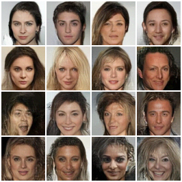

# Normalizing flows

Reimplementations of density estimation algorithms from:
* [Block Neural Autoregressive Flow](https://arxiv.org/abs/1904.04676)
* [Glow: Generative Flow with Invertible 1×1 Convolutions](https://arxiv.org/abs/1807.03039)


## Glow: Generative Flow with Invertible 1x1 Convolutions
https://arxiv.org/abs/1807.03039

Implementation of Glow on CelebA and MNIST datasets.

#### Results
I trained two models:
- Model A with 3 levels, 32 depth, 512 width (~74M parameters). Trained on 5 bit images, batch size of 16 per GPU over 100K iterations.
- Model B with 3 levels, 24 depth, 256 width (~22M parameters). Trained on 4 bit images, batch size of 32 per GPU over 100K iterations.

In both cases, gradients were clipped at norm 50, learning rate was 1e-3 with linear warmup from 0 over 2 epochs. Both reached similar results and 4.2 bits/dim.

##### Samples at varying temperatures
Temperatures ranging 0, 0.25, 0.5, 0.6, 0.7, 0.8, 0.9, 1 (rows, top to bottom):

| Model A | Model B |
| --- | --- |
|  |  |

##### Samples at temperature 0.7:
| Model A | Model B |
| --- | --- |
|  |  |

##### Model A attribute manipulation on in-distribution sample:

Embedding vectors were calculated for the first 30K training images and positive / negative attributes were averaged then subtracting. The resulting `dz` was ranged and applied on a test set image (middle image represents the unchanged / actual data point).

| Attribute | `dz` range [-2, -1, 0, 1, 2] |
| --- | --- |
| Brown hair |  |
| Male |  |
| Mouth slightly opened |  |
| Young |  |

##### Model A attribute manipulation on 'out-of-distribution' sample (i.e. me):

| Attribute | `dz` range |
| --- | --- |
| Brown hair |  |
| Mouth slightly opened |  |


#### Usage

To train a model using pytorch distributed package:
```
python -m torch.distributed.launch --nproc_per_node=NUM_GPUS_YOU_HAVE \
       glow.py --train \
               --distributed \
               --dataset=celeba \
               --data_dir=[path to data source] \
               --n_levels=3 \
               --depth=32 \
               --width=512 \
               --batch_size=16 [this is per GPU]
```
For larger models or image sizes add `--checkpoint_grads` to checkpoint gradients using pytorch's library. I trained a 3 layer / 32 depth / 512 width model with batch size of 16 without gradient checkpointing and a 4 layer / 48 depth / 512 width model with batch size of 16 which had ~190M params so required gradient checkpointing (and was painfully slow on 8 GPUs).


To evaluate model:
```
python glow.py --evaluate \
               --restore_file=[path to .pt checkpoint] \
               --dataset=celeba \
               --data_dir=[path to data source] \
               --[options of the saved model: n_levels, depth, width, batch_size]
```

To generate samples from a trained model:
```
python glow.py --generate \
               --restore_file=[path to .pt checkpoint] \
               --dataset=celeba \
               --data_dir=[path to data source] \
               --[options of the saved model: n_levels, depth, width, batch_size] \
               --z_std=[temperature parameter; if blank, generates range]
```

To visualize manipulations on specific image given a trained model:
```
python glow.py --visualize \
               --restore_file=[path to .pt checkpoint] \
               --dataset=celeba \
               --data_dir=[path to data source] \
               --[options of the saved model: n_levels, depth, width, batch_size] \
               --z_std=[temperature parameter; if blank, uses default] \
               --vis_attrs=[list of indices of attribute to be manipulated, if blank, manipulates every attribute] \
               --vis_alphas=[list of values by which `dz` should be multiplied, defaults [-2,2]] \
               --vis_img=[path to image to manipulate (note: size needs to match dataset); if blank uses example from test dataset]
```

#### Datasets

To download CelebA follow the instructions [here](http://mmlab.ie.cuhk.edu.hk/projects/CelebA.html). A nice script that simplifies downloading and extracting can be found here: https://github.com/nperraud/download-celebA-HQ/


#### References
* Official implementation in Tensorflow: https://github.com/openai/glow


## Dependencies
* python 3.6
* pytorch 1.0
* numpy
* matplotlib
* tensorboardX

###### Some of the datasets further require:
* pandas
* sklearn
* h5py
